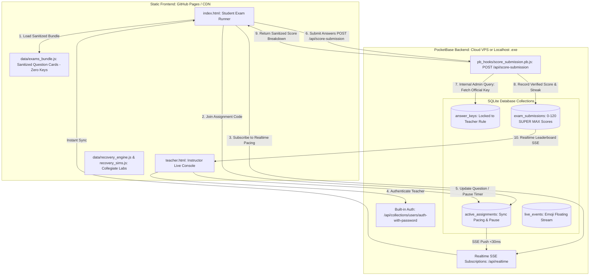

# Ultra-Secure Hybrid Key Storage & Deployment Architecture Plan for VectorSelect (PocketBase + GitHub Pages)

**File:** `C:\Users\fahad\.local\share\kilo\plans\1791074549100-hybrid-key-storage-plan.md`  
**Revision:** 6.0 (Migrated to PocketBase Backend & Server Hooks Architecture; Fully Synchronized with Phases 19–45: Collegiate Labs, Recovery Station, 0–120 SUPER MAX Scoring, Live Pause/Resume, & Teacher Two-Step Advance)  
**Target Repository:** `D:\APPS\VectorSelect by Mr. F\` & `c:\Users\fahad\Documents\GitHub\APPC-M\VectorSelect by Mr. F\`  
**Current Catalog Size:** 103 Assessments | 1,048 Questions (APP1 & APPC Mechanics)

---

### 1. Goal & Architecture Overview
- **Deployment Platform (Frontend)**: Host the entire client interface as a zero-build, ultra-fast static web application on **GitHub Pages** (`index.html` student runner, `teacher.html` control console, `data/exams_bundle.js` [stripped of keys], `data/recovery_engine.js`, `data/recovery_sims.js`).
- **Backend & Cloud Orchestration**: **PocketBase** (Go Single-Binary + SQLite + Server-Sent Events [SSE] Realtime + Built-in Auth + JavaScript Server Hooks):
  - **Single Binary Simplicity**: Zero Docker or external database dependencies; boots in <1 second and never pauses due to cloud inactivity.
  - **Sub-30ms Synchronized Realtime**: Realtime teacher-led pacing, pause/resume, and discussion states via PocketBase built-in SSE subscriptions (`pb.collection('active_assignments').subscribe()`).
  - **Live Leaderboard & Animated Podium**: Realtime SSE streaming of submissions, class averages, and student floating emoji reactions.
  - **Server-Side Atomic Grading**: Custom PocketBase Server Hook (`pb_hooks/score_submission.pb.js`) exposing `POST /api/score-submission` to grade tests server-side with zero student-side key exposure.
  - **Role-Based API Rules**: Restricts lobby control and official answer key access exclusively to authenticated teachers (`@request.auth.role = 'teacher'`).
- **Hybrid Answer Key Storage**:
  - **Cloud / PocketBase Production**: Answer keys stored in the protected PocketBase collection `answer_keys`. The public client bundle (`exams_bundle.js`) contains **zero** answers or explanations.
  - **Air-Gapped Offline Classroom Fallback**: In classrooms without internet access, teachers run `run_server.bat`, which boots local `pocketbase.exe serve` (port 8090) alongside the local static server (port 8888), with fallback to `data/answer_keys.js` (git-ignored).

---

### 2. Full System Architecture: Static Frontend + PocketBase Dynamic Backend



#### Incorporating Phases 19–45 Pedagogical & Gamification Enhancements:
1. **Collegiate Physics Laboratory Apparatuses (Phase 44)**:
   - Hosted statically on GitHub Pages via `data/recovery_sims.js` (5 Canvas lab stations: Ballistics Photogate, Friction Air Track, Centripetal Loop Strain Gauge, Damped Oscillator Oscilloscope, and Rotational Torque Beam).
2. **Procedural Recovery Engine (Phase 41)**:
   - `data/recovery_engine.js` generates 60+ algorithmic AP Physics problems with KaTeX derivations directly on the client.
3. **0–120 SUPER MAX Scoring Telemetry (Phase 38)**:
   - Server-side hook validates base points (100) + speed bonus (up to +20) = 120 max points, streak multipliers, and +3.5 point recovery redemptions.
4. **Pedagogical Neutral Lock & Prior-Miss Gating (Phases 39 & 43)**:
   - Client-side locks student selection neutrally without leaking correctness during live runs. Recovery station unlocks only after a prior missed question.
5. **Teacher Pacing Safety & Controls (Phases 29, 32, 43)**:
   - Two-Click Advance (`⚠️ Confirm Advance →` with 4s timeout), Previous Question traversal, and Synchronized Pause & Resume sync instantly across all student screens via PocketBase SSE.

---

### 3. Website Routing & Access Control

| Portal | URL Path | Access Policy |
|--------|----------|---------------|
| **Student Exam Runner** | `https://<username>.github.io/<repo-name>/` | Public access. Auto-loads `index.html`. |
| **Direct LMS Invite Link** | `https://<username>.github.io/<repo-name>/?join=CODE` | Public access. Pre-fills join code; student enters name only. |
| **Teacher Control Console** | `https://<username>.github.io/<repo-name>/teacher.html` | Protected by **PocketBase Auth** (`pb.collection('users').authWithPassword()`). Unauthenticated visitors see only the login modal. |
| **PocketBase Admin Dashboard** | `https://<pb-domain>/_` | Teacher/Admin collection browser, logs, and backup management. |

---

### 4. PocketBase Collections Schema & API Rules

#### 4.1 Collection: `answer_keys`
- **Fields**:
  - `assessment_id` (Text, Unique, Required) - e.g. `app1_unit1_1_1`
  - `subject` (Text, Required) - e.g. `AP Physics 1`
  - `unit` (Text, Required) - e.g. `Unit 1`
  - `keys` (JSON, Required) - `[{"question_id": "app1_unit1_1_1_q1", "correct_answer": "A", "explanation": "..."}]`
- **API Rules**:
  - **List/View Rule**: `@request.auth.role = "teacher"` (Students have zero access to read this collection).
  - **Create/Update/Delete Rule**: `null` (Admin only or via ingestion script).

#### 4.2 Collection: `active_assignments`
- **Fields**:
  - `join_code` (Text, Unique, Required, Indexed) - e.g. `849201`
  - `assessment_id` (Text, Required)
  - `title` (Text, Required)
  - `subject` (Text, Required)
  - `quiz_mode` (Text, Default: `'teacher_led'`) - `'teacher_led'` | `'student_led'`
  - `time_limit_minutes` (Number, Default: `0`)
  - `per_question_seconds` (Number, Default: `0`)
  - `current_question_index` (Number, Default: `0`)
  - `is_active` (Bool, Default: `true`)
  - `is_started` (Bool, Default: `false`)
  - `is_paused` (Bool, Default: `false`)
  - `remaining_seconds` (Number, Default: `0`)
  - `discussion_active` (Bool, Default: `false`)
  - `answer_revealed` (Bool, Default: `false`)
  - `allow_review` (Bool, Default: `true`)
  - `allow_calculator` (Bool, Default: `true`)
- **API Rules**:
  - **List/View Rule**: `is_active = true` (Public read for active exams).
  - **Create/Update/Delete Rule**: `@request.auth.role = "teacher"` (Instructors manage assignments).

#### 4.3 Collection: `exam_submissions`
- **Fields**:
  - `assignment` (Relation to `active_assignments`, Cascade Delete)
  - `join_code` (Text, Required, Indexed)
  - `student_name` (Text, Required)
  - `score` (Number, Required) - Raw correct count
  - `total_questions` (Number, Required)
  - `score_percentage` (Number, Required)
  - `points` (Number, Default: `0`) - 0–120 SUPER MAX Points
  - `speed_bonus` (Number, Default: `0`)
  - `max_streak` (Number, Default: `0`)
  - `recoveries_completed` (Number, Default: `0`)
  - `answers` (JSON, Required) - Sanitized response breakdown
  - `tab_switch_count` (Number, Default: `0`)
  - `fullscreen_exits` (Number, Default: `0`)
  - `time_spent_seconds` (Number, Default: `0`)
- **API Rules**:
  - **List/View Rule**: `""` (Public access to basic score leaderboard).
  - **Create/Update/Delete Rule**: `null` (Direct client writes are **completely disabled**; all submissions must pass through `POST /api/score-submission`).

#### 4.4 Collection: `live_events`
- **Fields**:
  - `join_code` (Text, Required, Indexed)
  - `event_type` (Text, Required) - e.g. `'emoji'`, `'discussion_toggle'`, `'answer_reveal'`
  - `payload` (JSON, Required) - `{ emoji: '🚀', student_name: 'Alex' }`
- **API Rules**:
  - **List/View Rule**: `""` (Subscribed via Realtime SSE by teacher & students).
  - **Create Rule**: `""` (Public broadcast allowed for emoji streams and student interaction).

---

### 5. Server-Side Atomic Grading Hook (`pb_hooks/score_submission.pb.js`)

PocketBase provides a built-in embedded JavaScript runtime. We define `pb_hooks/score_submission.pb.js`:

```javascript
// pb_hooks/score_submission.pb.js
routerAdd("POST", "/api/score-submission", (c) => {
    const data = $apis.requestInfo(c).data;
    const cleanCode = (data.join_code || "").trim().toUpperCase();
    const cleanName = (data.student_name || "").trim();

    if (cleanName.length < 2 || cleanName.length > 60) {
        return c.json(400, { error: "Invalid student name length" });
    }

    // 1. Fetch active assignment
    let assignment;
    try {
        assignment = $app.dao().findFirstRecordByData("active_assignments", "join_code", cleanCode);
    } catch (e) {
        return c.json(404, { error: "Assignment not found" });
    }

    if (!assignment.getBool("is_active")) {
        return c.json(400, { error: "Assignment is closed for submissions" });
    }

    // 2. Anti-Impersonation Check
    const existing = $app.dao().findRecordsByFilter(
        "exam_submissions",
        `join_code = {:code} && student_name ~ {:name}`,
        "-created",
        1,
        0,
        { code: cleanCode, name: cleanName }
    );
    if (existing && existing.length > 0) {
        return c.json(409, { error: "Student has already submitted this assessment" });
    }

    // 3. Fetch Official Answer Keys (internal privilege)
    let keyRecord;
    try {
        keyRecord = $app.dao().findFirstRecordByData("answer_keys", "assessment_id", assignment.getString("assessment_id"));
    } catch (e) {
        return c.json(500, { error: "Official answer keys are unavailable for this assessment" });
    }

    const officialKeys = keyRecord.get("keys") || [];
    const studentAnswers = data.answers || [];
    let correctCount = 0;
    const totalQuestions = officialKeys.length;
    const allowReview = (assignment.getBool("allow_review") && !assignment.getBool("is_active"));
    const breakdown = [];

    officialKeys.forEach((k) => {
        const studentPick = studentAnswers.find((a) => a.question_id === k.question_id);
        const selected = (studentPick && studentPick.selected) ? studentPick.selected.trim().toUpperCase() : null;
        const isCorrect = (selected !== null && selected === (k.correct_answer || "").trim().toUpperCase());
        if (isCorrect) correctCount++;

        breakdown.push({
            question_id: k.question_id,
            is_correct: isCorrect,
            selected: selected,
            correct_answer: allowReview ? k.correct_answer : null,
            explanation: allowReview ? k.explanation : null
        });
    });

    const scorePct = totalQuestions > 0 ? Number(((correctCount / totalQuestions) * 100).toFixed(1)) : 0;
    const verifiedPoints = Math.min(120.0, Math.max(0.0, Number(data.points || 0)));

    // 4. Save to exam_submissions
    const collection = $app.dao().findCollectionByNameOrId("exam_submissions");
    const record = new Record(collection);
    record.set("assignment", assignment.id);
    record.set("join_code", cleanCode);
    record.set("student_name", cleanName);
    record.set("score", correctCount);
    record.set("total_questions", totalQuestions);
    record.set("score_percentage", scorePct);
    record.set("points", verifiedPoints);
    record.set("speed_bonus", Math.max(0, Number(data.speed_bonus || 0)));
    record.set("max_streak", Math.max(0, Number(data.max_streak || 0)));
    record.set("recoveries_completed", Math.max(0, Number(data.recoveries_completed || 0)));
    record.set("answers", breakdown);
    record.set("tab_switch_count", Math.max(0, Number(data.tab_switches || 0)));
    record.set("fullscreen_exits", Math.max(0, Number(data.fullscreen_exits || 0)));
    record.set("time_spent_seconds", Math.max(0, Number(data.time_spent_seconds || 0)));

    $app.dao().saveRecord(record);

    // 5. Return sanitized result
    return c.json(200, {
        submission_id: record.id,
        score: correctCount,
        total_questions: totalQuestions,
        score_percentage: scorePct,
        points: verifiedPoints,
        review_available: allowReview,
        results: allowReview ? breakdown : breakdown.map(b => ({
            question_id: b.question_id,
            is_correct: b.is_correct
        }))
    });
});
```

---

### 6. Real-Time SSE Protocol (PocketBase SDK)

The frontend uses the official PocketBase JavaScript SDK (`https://cdn.jsdelivr.net/npm/pocketbase@0.21.5/dist/pocketbase.umd.js`):

```javascript
// pocketbase_config.js
const pb = new PocketBase(POCKETBASE_URL);

// Pacing & Live Control Subscription (Student Side)
pb.collection('active_assignments').subscribe(assignmentId, function (e) {
    if (e.action === 'update') {
        const a = e.record;
        if (a.current_question_index !== currentQuestionIndex) {
            handleTeacherPacingAdvance(a.current_question_index);
        }
        if (a.is_paused !== isTimerPaused) {
            handleLivePauseToggle(a.is_paused, a.remaining_seconds);
        }
        if (a.discussion_active !== isDiscussionActive) {
            handleDiscussionToggle(a.discussion_active);
        }
    }
});

// Live Floating Reaction Stream
pb.collection('live_events').subscribe('*', function (e) {
    if (e.action === 'create' && e.record.join_code === currentJoinCode) {
        if (e.record.event_type === 'emoji') {
            spawnFloatingEmoji(e.record.payload.emoji, e.record.payload.student_name);
        }
    }
});
```

---

### 7. Continuous Post-Launch Ingestion Pipeline

```powershell
# 1. Ingest PDFs, generate clean cards, strip bundle & build offline keys
python scripts/ingest_assignments.py

# 2. Seed answer keys to PocketBase via Admin API
python scripts/push_keys_to_pocketbase.py

# 3. Commit only sanitized bundle and assets to GitHub
git add assets/cards/ data/exams_bundle.js data/recovery_engine.js data/recovery_sims.js
git commit -m "feat: update assessments and collegiate lab stations"
git push origin main
```

---

### 8. Verification Matrix

| # | Verification Scenario | Test Method | Expected Result |
|---|-----------------------|-------------|------------------|
| 1 | **Bundle Zero Key Exposure** | Grep `exams_bundle.js` for `correct_answer`. | **0 occurrences found.** |
| 2 | **Server-Side Grading Integrity** | Submit exam via `POST /api/score-submission`. | Graded accurately by PocketBase hook; returns sanitized results. |
| 3 | **Teacher Auth Enclave** | Attempt unauthenticated GET on `answer_keys`. | PocketBase returns 403 Forbidden. |
| 4 | **Sub-30ms Realtime Advance** | Teacher advances question in `teacher.html`. | Student screen advances synchronously via SSE. |
| 5 | **Synchronized Live Pause** | Teacher clicks "Pause Timer". | Student countdown instantly freezes across all devices. |
6 | **Collegiate Lab Apparatus** | Student misses question and enters Recovery. | Interactive Canvas lab apparatus renders with multi-choice options. |
| 7 | **0–120 SUPER MAX Telemetry** | Complete exam with top speed and recovery. | Score is computed and persisted up to 120 points. |
| 8 | **Floating Emoji Broadcast** | Student taps `🚀` emoji. | PocketBase SSE broadcasts bubble to teacher projector view. |

---

### 9. Step-by-Step Implementation Sequence

1. **Step 1: Key Ingestion & Stripping Pipeline**:
   - Create `scripts/ingest_assignments.py` to parse `data/exams.json` / PDFs, write sanitized `data/exams_bundle.js` (with zero `correct_answer` or `explanation`), and generate offline `data/answer_keys.js`.
2. **Step 2: PocketBase Collections Setup & Grading Hook**:
   - Provide PocketBase collection schema JSON (`pocketbase_schema.json`) and `pb_hooks/score_submission.pb.js`.
   - Create `scripts/push_keys_to_pocketbase.py` to seed `answer_keys`.
3. **Step 3: Frontend Client Integration (`pocketbase_config.js`)**:
   - Replace Supabase calls with PocketBase JS SDK (`pocketbase_config.js`) supporting both cloud PocketBase and offline `run_server.bat` mode.
4. **Step 4: Update `index.html` & `teacher.html`**:
   - Wire student submissions to `/api/score-submission`.
   - Wire teacher live pacing, pause/resume, and discussion to PocketBase SSE.
5. **Step 5: Offline Classroom Package**:
   - Update `run_server.bat` to launch local `pocketbase.exe serve` alongside the web server.
6. **Step 6: GitHub Pages Deployment**:
   - Push sanitized static assets to GitHub repository and verify live dynamic operation on GitHub Pages.
