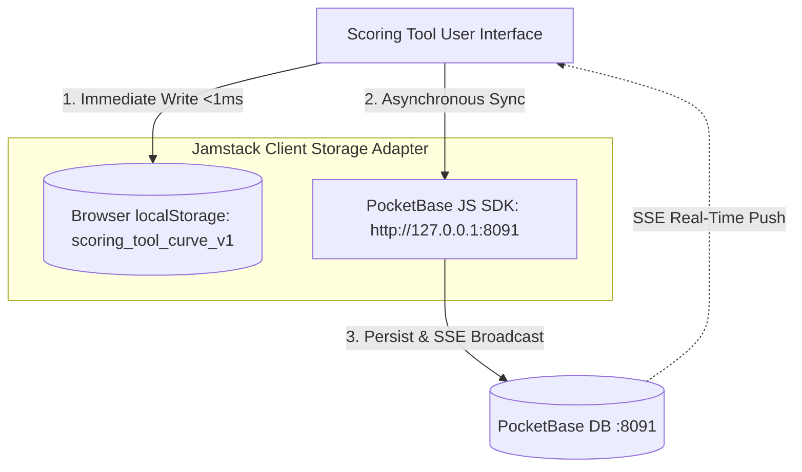

# Architecture & Deployment Plan: Approach B (Isolated Multi-Instance PocketBase for Scoring Tool)

**Architecture Model:** **Approach B — Physical Instance & Database Isolation**  
**Target Application:** `Scoring Tool` (`..\Scoring Tool\index.html`)  
**Dedicated Scoring Backend:** `Scoring Tool\pocketbase\` running on Port **`8091`**  
**VectorSelect Backend:** `VectorSelect by Mr. F\pocketbase\` running on Port **`8090`** (100% Untouched)  
**Admin Identity:** Unified across both instances (`739156332@qq.com` / `physics2026`)  
**Legacy Migration:** **Complete Deprecation & Removal of Supabase**  
**Document Location:** `c:\Users\fahad\Documents\GitHub\APPC-M\VectorSelect by Mr. F\SCORING_TOOL_POCKETBASE_PLAN.md`  
**Revision:** 3.0 (Approach B Multi-Instance Specification)  

---

## 1. Architectural Strategy: Why Approach B?

Under **Approach B**, each classroom application operates with its own dedicated PocketBase runtime, its own SQLite database file, and its own network port:

```
┌──────────────────────────────────────────────┐        ┌──────────────────────────────────────────────┐
│           VECTORSELECT BY MR. F              │        │               SCORING TOOL                   │
│       (Instance 1 — Port 8090)               │        │         (Instance 2 — Port 8091)             │
│                                              │        │                                              │
│ • Directory: VectorSelect by Mr. F\pocketbase│        │ • Directory: Scoring Tool\pocketbase\        │
│ • Database:  pb_data\data.db (VectorSelect)  │        │ • Database:  pb_data\data.db (Scoring Tool)  │
│ • Tables:    answer_keys, active_assignments,│        │ • Tables:    scoring_classes, scoring_asgns, │
│              exam_submissions, live_events   │        │              scoring_records, scoring_presets│
│ • Frontend:  index.html & teacher.html       │        │ • Frontend:  index.html (Jamstack)           │
│ • Status:    COMPLETELY PROTECTED & UNTOUCHED│        │ • Status:    INDEPENDENT & ISOLATED          │
└──────────────────────────────────────────────┘        └──────────────────────────────────────────────┘
```

### Key Advantages of Approach B
1. **Zero-Touch Isolation for VectorSelect**:
   - Zero chance of schema conflicts, migration collisions, or unintended database writes.
   - VectorSelect's live quiz runner, pacing engines, and answer key enclaves on port 8090 continue running without a single byte changed.
2. **Unified Teacher Credentials**:
   - Both PocketBase instances recognize the exact same teacher credentials (`739156332@qq.com` / `physics2026`), so there are no extra passwords to remember.
3. **True Jamstack Frontend Architecture**:
   - Scoring Tool (`Scoring Tool/index.html`) is 100% Jamstack: pure client-side JavaScript, static HTML/CSS markup, and asynchronous REST/SSE communication to its headless backend on port 8091.
4. **Air-Gapped Portability**:
   - The entire `Scoring Tool\` directory (including its embedded database) can be zipped, backed up, or copied to any teacher computer as a standalone unit.

---

## 2. Complete Deprecation & Removal of Supabase

> [!CAUTION]
> ### Supabase Purge Directive
> Historical plans (e.g. `.kilo/plans/1790123586486-classroom-hub-supabase-sync.md`) contemplated integrating with Supabase (`https://cabjyjqbfnntcdqqmjhu.supabase.co`) with a remote `curve_state` table.
> 
> **Under Approach B, Supabase is completely eliminated:**
> - **Zero External SaaS Dependencies**: No monthly subscription limits, zero egress fees, and no remote downtime risks.
> - **Air-Gapped Offline Execution**: Scoring Tool works 100% offline inside the classroom with local SQLite on port 8091.
> - **Purge Stubs**: Dead `/api/curve` calls from the legacy Classroom Hub server and any Supabase SDK references are completely excised.

---

## 3. Dedicated Directory Layout (`Scoring Tool\pocketbase\`)

Scoring Tool maintains its own complete PocketBase stack:

```text
Scoring Tool/
├── index.html                                <-- Jamstack Client Frontend
├── pocketbase.umd.js                         <-- Offline PocketBase Client SDK
├── pocketbase/                               <-- Dedicated Backend Directory
│   ├── pb_data/                              <-- Own SQLite database (data.db)
│   │   ├── data.db
│   │   └── logs.db
│   ├── pb_hooks/                             <-- Dedicated Goja server hooks
│   ├── pb_migrations/                        <-- Auto-migration scripts
│   │   └── 1791121000_created_scoring_tool_collections.js
│   ├── pb_public/                            <-- Optional static web hosting
│   ├── pocketbase.exe                        <-- Standalone PocketBase v0.22.4 binary
│   ├── scoring_tool_schema.json              <-- Dedicated collections schema
│   ├── run_pocketbase.bat                    <-- Dedicated port 8091 launcher
│   ├── LICENSE.md
│   └── CHANGELOG.md
```

### Dedicated Launcher: `Scoring Tool\pocketbase\run_pocketbase.bat`
```cmd
@echo off
title Scoring Tool PocketBase Engine
echo ======================================================================
echo Starting Scoring Tool PocketBase Backend on port 8091...
echo ======================================================================
echo.
pocketbase.exe serve --http=127.0.0.1:8091 --dir=pb_data --hooksDir=pb_hooks
pause
```

---

## 4. Dedicated Database Schema (`scoring_tool_schema.json`)

All collections are stored in `Scoring Tool\pocketbase\pb_data\data.db`:

### 1. `scoring_classes`
Stores class cohorts, rosters, and custom drag-and-drop sort orders:
- **`name`** (text, unique): `"AP Physics C"`, `"AP Physics 1"`, `"Honors Physics 1"`, `"Honors Physics 2"`
- **`period`** (text): e.g. `"Period 1"`
- **`academic_year`** (text): e.g. `"2025-2026"`
- **`roster`** (json): Array of student objects: `[{ "id": "s_0eu0i5j5", "name": "Kenny Cao" }, ...]`
- **`sort_order`** (json): Array of student IDs preserving manual row positioning.

### 2. `scoring_assignments`
Stores grading sessions, curves, and category scaling factors:
- **`class_name`** (text): Target cohort
- **`title`** (text): e.g. `"Unit 1 Progress Check MCQ"`
- **`date`** (date): Assessment date
- **`mode`** (select): `"ap"` (AP curve bands) or `"formula"` (mathematical formula)
- **`max_raw`** (number): Total raw points possible (default: 100)
- **`formula`** (text): Custom formula (e.g. `"=ROUND(RAW_PCT*1.08, 1)"`)
- **`categories_config`** (json): Multi-category toggles, max scores, and scaling factors:
  ```json
  {
    "mcq": { "en": true, "mx": 40, "sc": 52 },
    "fib": { "en": true, "mx": 10, "sc": 10 },
    "sa":  { "en": true, "mx": 15, "sc": 15 },
    "frq": { "en": true, "mx": 48, "sc": 48 }
  }
  ```
- **`bands_config`** (json): Cutoff thresholds for AP scores 1 through 5:
  ```json
  [
    { "ap": 5, "rMin": 70, "rMax": 100, "cMin": 90, "cMax": 100 },
    { "ap": 4, "rMin": 54, "rMax": 69.9, "cMin": 75, "cMax": 89 },
    { "ap": 3, "rMin": 40, "rMax": 53.9, "cMin": 60, "cMax": 74 },
    { "ap": 2, "rMin": 25, "rMax": 39.9, "cMin": 30, "cMax": 59 },
    { "ap": 1, "rMin": 0, "rMax": 24.9, "cMin": 0, "cMax": 29 }
  ]
  ```

### 3. `scoring_records`
Stores individual student grades for an assignment:
- **`assignment_id`** (text): ID of the parent assignment
- **`class_name`** (text): Target class
- **`student_id`** (text): Unique student identifier
- **`student_name`** (text): Student display name
- **`mcq`**, **`fib`**, **`sa`**, **`frq`** (text): Category raw scores
- **`raw_score`** (number): Computed composite raw score
- **`raw_pct`** (number): Computed percentage
- **`curved_pct`** (number): Final curved percentage
- **`ap_score`** (number): Assigned AP score (1–5)
- **`row_order`** (number): Drag-and-drop sort position

### 4. `scoring_presets`
Reusable curve formula and AP band presets:
- **`name`** (text, unique): e.g. `"AP Physics 1 Standard Curve"`
- **`type`** (select): `"ap_bands"` or `"formula"`
- **`preset_data`** (json): Stored cutoffs or formula string
- **`is_default`** (bool): Default curve preset flag

---

## 5. Jamstack Client Architecture & Offline-First Dual Storage

Scoring Tool implements a robust **dual-storage client pattern**:



1. **Immediate Write (`localStorage`)**: Whenever a teacher types a score or modifies a band, it writes to `localStorage` in <1ms. If the browser is refreshed or PocketBase is offline, zero work is ever lost.
2. **Background Sync (`PocketBase :8091`)**: In the background, the PocketBase client asynchronously syncs changes to `http://127.0.0.1:8091`.
3. **Real-Time Multi-Device Sync**: Subscribes to `scoring_records` (`pb.collection('scoring_records').subscribe('*')`) so multiple open tabs or co-teachers grading on different machines synchronize live.
4. **Visual Sync Indicator**:
   - 🟢 `PocketBase Connected (:8091)`
   - 🟡 `Offline Mode (Local Storage Only)`

---

## 6. Non-Invasive Passive Bridge to VectorSelect

When the teacher wants to pull MCQ scores from a VectorSelect exam:
- **Passive Read-Only Access**: Scoring Tool initiates an HTTP `GET` request to VectorSelect on port 8090 (`http://127.0.0.1:8090/api/collections/exam_submissions/records`).
- **Zero Writing**: Scoring Tool will **never write, update, or touch** VectorSelect's database.
- **CSV Fallback**: The teacher can also simply export results from VectorSelect as a CSV and drop it into Scoring Tool.

---

## 7. Execution Checklist for Approach B

| Step | Task | Safety Guarantee |
| :--- | :--- | :--- |
| **1** | Directory Setup: Ensure `Scoring Tool\pocketbase\` has `pb_data/`, `pb_migrations/`, `pb_hooks/`, and `run_pocketbase.bat` (Port 8091) | Completed; VectorSelect completely isolated |
| **2** | Migration Script: Ensure `1791121000_created_scoring_tool_collections.js` is in `Scoring Tool\pocketbase\pb_migrations\` | Auto-creates tables on boot |
| **3** | Code Cleanup: Remove dead `/api/curve` stubs and all Supabase mentions from `Scoring Tool\index.html` | Eradicates dead code |
| **4** | Jamstack Client SDK: Vendor `pocketbase.umd.js` and connect client adapter to `http://127.0.0.1:8091` | Offline-first with auto-sync |
| **5** | Verification: Confirm VectorSelect on `8090` and Scoring Tool on `8091` run concurrently with zero conflict | Dual-instance autonomy verified |
| **6** | Documentation: Update `implementation.md` and commit to Git repository | Global documentation compliance |

---

## 8. Summary of Guarantees
- **VectorSelect Integrity**: VectorSelect remains on port `8090` with zero changes to code or data.
- **Scoring Tool Independence**: Scoring Tool has its own dedicated PocketBase on port `8091`.
- **Zero Supabase**: Completely self-contained, air-gapped, zero cloud cost, and private.
