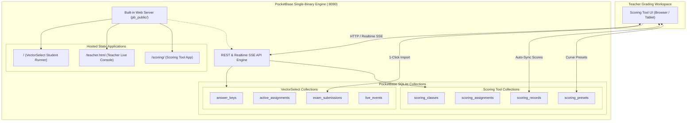

# Architecture & Deployment Plan: Pushing Scoring Tool to PocketBase

**Target Application:** `Scoring Tool` (`..\Scoring Tool\index.html`)  
**Backend Host:** PocketBase (`pocketbase/pocketbase.exe`)  
**Project Folder:** `c:\Users\fahad\Documents\GitHub\APPC-M\VectorSelect by Mr. F\`  
**Mirror Locations:** `D:\APPS\VectorSelect by Mr. F\` & `D:\APPS\marker\web_app\`  
**Author:** Antigravity Engineering (Physics Classroom Architecture Team)  
**Version:** 1.0.0 (Production Roadmap)  

---

## 1. Executive Summary & Objectives

### Current State of Scoring Tool
`Scoring Tool` is currently a standalone single-file web application located at `..\Scoring Tool\index.html` in the root repository. It provides high-utility grading, AP score curve mapping, and formula-based curve calculations for 4 physics cohorts (AP Physics C, AP Physics 1, Honors Physics 1, and Honors Physics 2).

Currently, it suffers from two major limitations:
1. **Isolated Storage**: Scores, custom curve formulas, category weights, and manual student sorting orders are persisted exclusively in the browser's `localStorage` (`scoring_tool_curve_v1`), making grades inaccessible across devices, vulnerable to browser cache clearing, and isolated from teacher workstations.
2. **Disconnected Ecosystem**: Even though students complete quizzes and tests in **VectorSelect by Mr. F**, the teacher must manually transcribe scores into the Scoring Tool instead of having scores flow automatically from PocketBase.

### Core Objectives of "Pushing to PocketBase"
1. **Unified Static Web Hosting (`pb_public/scoring/`)**:
   - Host the Scoring Tool web application directly through PocketBase's built-in high-performance web server alongside VectorSelect, eliminating separate HTTP servers or file:// protocol barriers.
2. **Robust Multi-Device Database Persistence**:
   - Transition from fragile browser storage to 4 dedicated, relational PocketBase collections (`scoring_classes`, `scoring_assignments`, `scoring_records`, and `scoring_presets`).
3. **Sub-30ms Real-Time Multi-Tab Synchronization**:
   - Leverage PocketBase Server-Sent Events (SSE) so grading inputs made on an iPad, laptop, or co-teacher's machine synchronize in real time.
4. **VectorSelect $\leftrightarrow$ Scoring Tool Bridge**:
   - Build a direct import bridge connecting VectorSelect's `exam_submissions` collection to Scoring Tool's grade sheet, allowing 1-click import of student MCQ raw scores.
5. **Role-Based Security & Offline Resilience**:
   - Protect grade records behind Teacher Authentication while maintaining an offline-first cache so grading continues uninterrupted during network disconnects.

---

## 2. System Architecture & Topology



---

## 3. Database Schema Design (New PocketBase Collections)

To support complete data synchronization without touching or risking existing VectorSelect collections, we define 4 specialized collections:

### Collection 1: `scoring_classes`
Stores class rosters, student IDs, and class metadata.
- **`id`**: 15-char unique ID (e.g. `cls_appc_2026`)
- **`name`**: Text (e.g. `"AP Physics C"`, `"AP Physics 1"`, `"Honors Physics 1"`, `"Honors Physics 2"`)
- **`period`**: Text (e.g. `"Period 1"`, `"Period 3"`)
- **`academic_year`**: Text (e.g. `"2025-2026"`)
- **`roster`**: JSON array of student objects:
  ```json
  [
    { "id": "s_0eu0i5j5", "name": "Kenny Cao" },
    { "id": "s_180sq604", "name": "Daniel Cui" }
  ]
  ```
- **`sort_order`**: JSON array storing manual drag-and-drop student ID ordering.
- **Rules**:
  - `listRule` / `viewRule`: `@request.auth.id != ""` (Authenticated Teacher)
  - `createRule` / `updateRule` / `deleteRule`: `@request.auth.id != ""`

### Collection 2: `scoring_assignments`
Represents an assessment or grading session (e.g., "Unit 1 Kinematics Exam").
- **`id`**: 15-char unique ID
- **`class_id`**: Relation to `scoring_classes`
- **`title`**: Text (e.g. `"Unit 1 Progress Check MCQ"`)
- **`date`**: Date/Time
- **`mode`**: Select (`"ap"` or `"formula"`)
- **`max_raw`**: Number (default `100`)
- **`formula`**: Text (default `"=RAW_PCT"`)
- **`categories_config`**: JSON object defining active categories, weights, and scale factors:
  ```json
  {
    "mcq": { "en": true, "mx": 40, "sc": 52 },
    "fib": { "en": true, "mx": 10, "sc": 10 },
    "sa":  { "en": true, "mx": 15, "sc": 15 },
    "frq": { "en": true, "mx": 48, "sc": 48 }
  }
  ```
- **`bands_config`**: JSON array storing AP 1–5 score boundary definitions:
  ```json
  [
    { "ap": 5, "rMin": 70, "rMax": 100, "cMin": 90, "cMax": 100 },
    { "ap": 4, "rMin": 54, "rMax": 69.9, "cMin": 75, "cMax": 89 },
    { "ap": 3, "rMin": 40, "rMax": 53.9, "cMin": 60, "cMax": 74 },
    { "ap": 2, "rMin": 25, "rMax": 39.9, "cMin": 30, "cMax": 59 },
    { "ap": 1, "rMin": 0, "rMax": 24.9, "cMin": 0, "cMax": 29 }
  ]
  ```
- **`linked_vectorselect_code`**: Text (optional join code or assessment ID for auto-sync).

### Collection 3: `scoring_records`
Stores individual student grade entries for a given assignment.
- **`id`**: 15-char unique ID
- **`assignment_id`**: Relation to `scoring_assignments` (Cascade delete on delete assignment)
- **`student_id`**: Text (e.g. `"s_0eu0i5j5"`)
- **`student_name`**: Text
- **`mcq`**: Text / Number (e.g. `"36"` or `36`)
- **`fib`**: Text / Number
- **`sa`**: Text / Number
- **`frq`**: Text / Number
- **`raw_score`**: Number (calculated composite raw score)
- **`raw_pct`**: Number (calculated raw percentage)
- **`curved_pct`**: Number (curved result percentage)
- **`ap_score`**: Number (1, 2, 3, 4, or 5 in AP mode)
- **`notes`**: Text
- **`updated_by`**: Relation to `users`

### Collection 4: `scoring_presets`
Reusable curve templates (e.g. "Strict Mechanics Curve", "AP Physics 1 Standard Curve").
- **`id`**: 15-char unique ID
- **`name`**: Text (e.g. `"AP Physics 1 Standard 2026"`)
- **`type`**: Select (`"ap_bands"` or `"formula"`)
- **`preset_data`**: JSON containing bands array or formula string.
- **`is_default`**: Bool

---

## 4. Static Hosting Strategy via PocketBase (`pb_public`)

PocketBase natively serves static assets placed inside `./pb_public/` relative to the server working directory.

### Directory Structure Plan
```text
VectorSelect by Mr. F/
├── pocketbase/
│   ├── pb_data/                          <-- SQLite database (data.db)
│   ├── pb_hooks/                         <-- Goja JS server hooks
│   ├── pb_migrations/                    <-- Schema migrations
│   │   └── 1791120000_created_scoring_tool_collections.js  (New migration)
│   ├── pb_public/                        <-- Static web root
│   │   ├── index.html                    <-- VectorSelect Student Exam Runner
│   │   ├── teacher.html                  <-- VectorSelect Teacher Console
│   │   ├── data/                         <-- VectorSelect question banks & sims
│   │   └── scoring/                      <-- SCORING TOOL APP
│   │       ├── index.html                <-- Enhanced Scoring Tool UI
│   │       ├── pocketbase.umd.js         <-- PocketBase Client JS SDK
│   │       └── scoring_pb_bridge.js      <-- Cloud sync & VectorSelect importer
│   ├── pocketbase.exe
│   └── run_pocketbase.bat
```

### URLs when Running PocketBase
- **Scoring Tool**: `http://127.0.0.1:8090/scoring/` (or `https://<domain>/scoring/`)
- **VectorSelect Student Runner**: `http://127.0.0.1:8090/`
- **VectorSelect Teacher Portal**: `http://127.0.0.1:8090/teacher.html`
- **PocketBase Admin Console**: `http://127.0.0.1:8090/_/`

---

## 5. VectorSelect $\leftrightarrow$ Scoring Tool Bridge: Automated Grade Flow

Currently, when students complete a live exam on VectorSelect, records are stored in `exam_submissions`:
- `assessment_id` (e.g. `"APPC_U1_01"`)
- `student_name` (e.g. `"Kenny Cao"`)
- `score` / `points_earned` / `total_possible` (e.g. `34.5 / 40`)
- `accuracy` (e.g. `86.25%`)

### The Bridge Workflow
1. In Scoring Tool, when creating or viewing an assignment, the teacher clicks **"⚡ Import from VectorSelect"**.
2. A modal displays recent completed assignments from `active_assignments` or queries `exam_submissions`.
3. Selecting an assignment pulls all submissions:
   - Matches student names with the roster.
   - Automatically populates the `MCQ` column with their raw points.
   - Calculates the raw score, curved score, and AP score instantly.
   - Flags any unmatched names for manual review.
4. Saves all imported grades to PocketBase `scoring_records` in a single transaction.

---

## 6. Implementation Phases & Step-by-Step Roadmap

### Phase 1: PocketBase Schema & Migration Script
- Create `pocketbase/pb_migrations/1791120000_created_scoring_tool_collections.js` declaring:
  - `scoring_classes`
  - `scoring_assignments`
  - `scoring_records`
  - `scoring_presets`
- Export and update `pocketbase/pocketbase_schema.json`.
- Populate initial roster data for the 4 classes from `Scoring Tool/index.html` into `scoring_classes`.

### Phase 2: Static Asset Setup & pb_public Assembly
- Create `pocketbase/pb_public/scoring/`.
- Download/vendor `pocketbase.umd.js` (or configure CDN fallback `https://cdnjs.cloudflare.com/ajax/libs/pocketbase/0.21.3/pocketbase.umd.js`) so the app operates completely offline in air-gapped classrooms.
- Copy and adapt `..\Scoring Tool\index.html` to `pocketbase/pb_public/scoring/index.html`.

### Phase 3: Client-Side PocketBase Adapter (`scoring_pb_bridge.js`)
- Implement a robust data layer inside the Scoring Tool:
  - **Connection Status Indicator**: Displays a subtle pill in the header:
    - 🟢 `Cloud Synced (PocketBase)`
    - 🟡 `Offline Mode (Local Storage)`
  - **Dual-Storage Logic**:
    - Reads from PocketBase first; if offline, reads from `localStorage`.
    - Writes to both `localStorage` (immediate safety) and PocketBase (background async sync).
  - **Real-Time SSE Subscription**:
    - Listens to `scoring_records` changes so edits made on a second screen reflect immediately.

### Phase 4: Teacher Authentication & Access Security
- Integrate with existing PocketBase Teacher Auth:
  - If the teacher is already logged into the Teacher Portal (`sessionStorage.getItem('pb_auth')`), reuse the token.
  - Provide a clean login dialog in Scoring Tool if unauthenticated (`admin` or teacher role).

### Phase 5: VectorSelect Live Import Feature
- Add an "Import from VectorSelect" button to the Scoring Tool header toolbar.
- Build the matching and auto-fill logic.
- Test with simulated and live student submissions.

### Phase 6: Sync, Deployment, & Cross-Directory Mirroring
- Update `pocketbase/run_pocketbase.bat` to ensure `pb_public` is served properly.
- Update Dockerfile in `pocketbase/README_DEPLOY.md` to include:
  ```dockerfile
  COPY ./pb_public /pb/pb_public
  ```
- Mirror all assets to `D:\APPS\VectorSelect by Mr. F\` and `D:\APPS\marker\web_app\`.
- Update `implementation.md` with full documentation of Phase 64.

---

## 7. Risk Analysis & Contingency Planning

| Risk | Impact | Mitigation Strategy |
| :--- | :--- | :--- |
| **Existing VectorSelect Data Corruption** | High | All new collections have namespaced prefixes (`scoring_*`). Existing collections (`answer_keys`, `active_assignments`, etc.) remain completely untouched. |
| **Air-Gapped Offline Operation** | High | The app retains full `localStorage` fallback. If PocketBase server is down or unconfigured, the app functions 100% identically to its current state without throwing errors. |
| **Student Name Variations during Import** | Low | Implement fuzzy string matching (case-insensitive, whitespace-trimmed, and Levenshtein distance check) with a manual confirmation modal for ambiguous names. |
| **Accidental Overwrites in Multi-Tab** | Medium | Use PocketBase record `updated` timestamp checks or field-level updates instead of whole-class bulk replaces. |

---

## 8. Verification & Acceptance Criteria
- [ ] Scoring Tool accessible at `http://127.0.0.1:8090/scoring/` with zero console errors.
- [ ] PocketBase stores all 4 cohorts in `scoring_classes`.
- [ ] Entering a grade on one tab updates another tab via SSE in under 100ms.
- [ ] Clicking "Import from VectorSelect" populates MCQ scores from an active assignment.
- [ ] Exporting to CSV produces clean, properly curved student reports.
- [ ] App continues working smoothly even when PocketBase server is disconnected.
